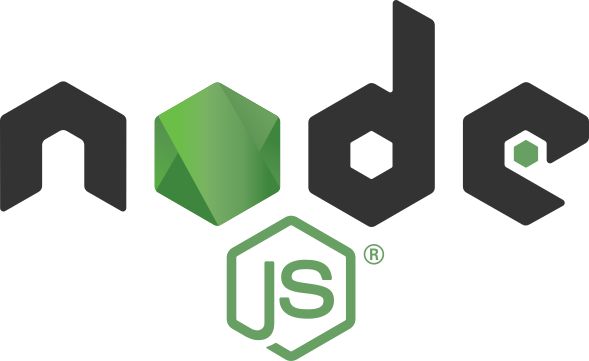

<div align="center">
	<h1>ReserveL</h1>
   <p><b>Web3 ile Rezervasyon Yönetimi</b></p>
</div>

<div align="center">
  <table>
    <tr>
      <td align="center" valign="middle">
        <a href="https://react.dev/"></a>
      </td>
      <td align="center" valign="middle">
        <a href="https://www.mongodb.com/"></a>
      </td>
      <td align="center" valign="middle">
        <a href="https://nodejs.org/tr"></a>
      </td>
      <td align="center" valign="middle">
        <a href="https://tailwindcss.com/"></a>
      </td>
      <td align="center" valign="middle">
        <a href="https://nextjs.org/"></a>
      </td>
    </tr>
  </table>
</div>


---

## Kurulum ve Çalıştırma

1. **Depoyu klonlayın:**
  ```bash
  git clone https://github.com/ksyusuf/ReserveL.git
  cd ReserveL/app
  ```

2. **Gerekli paketleri yükleyin:**
  ```bash
  npm install
  ```

3. **Geliştirme sunucusunu başlatın:**
  ```bash
  npm run dev
  ```

4. **Projeyi tarayıcıda görüntüleyin:**
   
  [http://localhost:3000](http://localhost:3000)

> Not: Proje Next.js, React, Tailwind CSS ve MongoDB gibi teknolojiler kullanır. Geliştirme için Node.js 18+ önerilir.

---
## Project Structure

- `/src/app` - Next.js App Router pages and API routes
- `/src/components` - React components
- `/src/lib` - Utility functions and shared code

---


## Environment Variables

Create a `.env.local` file in the root directory and add the following variables:

```
MONGODB_URI=
NEXT_PUBLIC_APP_URL=http://localhost:3000
NEXT_PUBLIC_CONTRACT_ID=CACV2ECSIDU37E5OD3X6NEQ4C7QXER3MRVPWNIISB5PV6NDKM7OP3U7I
NEXT_PUBLIC_ENVIRONMENT=Development
```

For smart contract initialization and management, please refer to [contracts/README.md](contracts/README.md).

## Son Güncellemeler <small></small>

✔️ İşletme kayıt ve giriş işlemleri eklendi.<br>
✔️ Kontrat fonksiyonunun dönüş değeri simülasyondan alınıyor.<br>
✔️ Veritabanına işletme modelleri eklendi.<br>
✔️ İşletme kayıt ve giriş sayfaları UI düzenlemesi yapılacak.<br>
✔️ İşletme kaydı akışı register page'de <i>todo</i> olarak belirtildi.<br>
✔️️ Rezervasyona gelmemiş müşteriler 30 dakika sonra otomatik olarak no_show olarak işaretlenir.<br>

---

## Notlar

⚠️ Stellar tarafında bazı değişiklikler oldu, program bozulmuştu ama şimdilik çalışıyor.<br>
⚠️ <code>pollTransaction</code> bozuldu, artık onun yerine <code>getTransaction</code>'a manuel istek atıyoruz.
