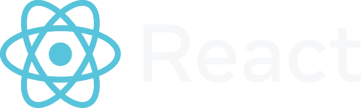

<div align="center">
	<h1>ReserveL</h1>
   <p><b>Web3 ile Rezervasyon Yönetimi</b></p>
</div>

<div align="center" style="margin-top: 16px; display: flex; justify-content: center; align-items: center; gap: 24px; flex-wrap: wrap;">
  <a href="https://react.dev/"></a>
  <a href="https://www.mongodb.com/"><svg role="img" aria-label="MongoDB Logo" class="leafygreen-ui-adyqyf" width="12" viewBox="0 0 15 32" fill="none"><path d="M10.2779 3.56801C8.93285 1.97392 7.76219 0.354933 7.52557 0.0186807C7.50066 -0.00622689 7.4633 -0.00622689 7.43839 0.0186807C7.20177 0.354933 6.04357 1.97392 4.69856 3.56801C-6.8461 18.2759 6.51681 28.1891 6.51681 28.1891L6.6289 28.2639C6.72853 29.7957 6.9776 32 6.9776 32H7.47576H7.97391C7.97391 32 8.22298 29.8081 8.32261 28.2639L8.4347 28.1767C8.44715 28.1891 21.8225 18.2759 10.2779 3.56801ZM7.48821 27.9774C7.48821 27.9774 6.89043 27.4668 6.72853 27.2053V27.1804L7.45085 11.1648C7.45085 11.115 7.52557 11.115 7.52557 11.1648L8.24789 27.1804V27.2053C8.08599 27.4668 7.48821 27.9774 7.48821 27.9774Z" fill="#00ED64"></path></svg></a>
  <a href="https://nodejs.org/tr"></a>
  <a href="https://tailwindcss.com/"></a>
  <a href="https://nextjs.org/"></a>
</div>

---

## Kurulum ve Çalıştırma

1. **Depoyu klonlayın:**
  ```bash
  git clone https://github.com/ksyusuf/ReserveL.git
  cd ReserveL/app
  ```

2. **Gerekli paketleri yükleyin:**
  ```bash
  npm install
  ```

3. **Geliştirme sunucusunu başlatın:**
  ```bash
  npm run dev
  ```

4. **Projeyi tarayıcıda görüntüleyin:**
   
  [http://localhost:3000](http://localhost:3000)

> Not: Proje Next.js, React, Tailwind CSS ve MongoDB gibi teknolojiler kullanır. Geliştirme için Node.js 18+ önerilir.

---
## Project Structure

- `/src/app` - Next.js App Router pages and API routes
- `/src/components` - React components
- `/src/lib` - Utility functions and shared code

---


## Environment Variables

Create a `.env.local` file in the root directory and add the following variables:

```
MONGODB_URI=
NEXT_PUBLIC_APP_URL=http://localhost:3000
NEXT_PUBLIC_CONTRACT_ID=CACV2ECSIDU37E5OD3X6NEQ4C7QXER3MRVPWNIISB5PV6NDKM7OP3U7I
NEXT_PUBLIC_ENVIRONMENT=Development
```

For smart contract initialization and management, please refer to [contracts/README.md](contracts/README.md).

## Son Güncellemeler <small></small>

✔️ İşletme kayıt ve giriş işlemleri eklendi.<br>
✔️ Kontrat fonksiyonunun dönüş değeri simülasyondan alınıyor.<br>
✔️ Veritabanına işletme modelleri eklendi.<br>
✔️ İşletme kayıt ve giriş sayfaları UI düzenlemesi yapılacak.<br>
✔️ İşletme kaydı akışı register page'de <i>todo</i> olarak belirtildi.<br>
✔️️ Rezervasyona gelmemiş müşteriler 30 dakika sonra otomatik olarak no_show olarak işaretlenir.<br>

---

## Notlar

⚠️ Stellar tarafında bazı değişiklikler oldu, program bozulmuştu ama şimdilik çalışıyor.<br>
⚠️ <code>pollTransaction</code> bozuldu, artık onun yerine <code>getTransaction</code>'a manuel istek atıyoruz.